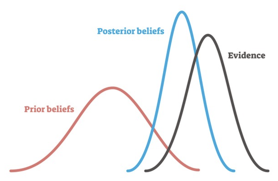

## Contents

- Data and problem formulation

- Bayesian Statistics Solution

- Empirical Bayes

- Beta binomial regression


```{r eval=TRUE, include=FALSE}
library(gamlss)
library(nbastatR)
library(dplyr)
library(ggplot2)
library(ebbr)
theme_set(theme_minimal())

df <- read.csv("shot_logs.csv")

player_summaries <- df %>% 
  filter(PTS_TYPE == 3, PERIOD == 4) %>% 
  group_by(player_name, player_id) %>% 
  summarise(
    n_attempts = n(),
    n_3pts = sum(SHOT_RESULT == 'made'),
    ratio_3pt = sum(SHOT_RESULT == 'made') / n()
  ) %>% 
  ungroup()

profiles <- read.csv("player_data.csv") %>% 
  select(idPlayer, weightLBS, heightInches, dateBirth)

player_df <- player_summaries %>% 
  left_join(profiles, by = c("player_id" = "idPlayer")) %>% 
  filter(!is.na(weightLBS))

player_df$weight <- player_df$weightLBS / 2.2
player_df$height <- player_df$heightInches * 2.54 / 100
player_df$age <- 2015 - lubridate::year(player_df$dateBirth)
# player_df$age <- pmin(player_df$age, 35L)
player_df$bmi <- player_df$weight / (player_df$height) ** 2
player_df$weightLBS <- NULL
player_df$heightInches <- NULL
player_df$dateBirth <- NULL
player_df$player_id <- NULL
# player_df$player_id <- NULL

```

---

## Data and problem formulation

- Data from 2015-2016 NBA season

- For every player, we have: 
  - How many 3-point attempts they did in the 4th quarter.
  - How many of them were scored.
  - We also have player features like age and BMI.

- We want to know who are the best 3-point shooters in the 4th quarter.

```{r}
player_df %>% select(player_name:ratio_3pt, age, bmi) %>% head(5)
```

---

## Who are the best 3-point shooters?

```{r}
player_df %>% 
  select(player_name:ratio_3pt) %>% 
  arrange(desc(ratio_3pt)) %>% head(5)
```

--

Naive point of view says that the best shooters are players who've shot once and have a 100% 3pt ratio.

---

##  Frequentist solution

Use a test to determine if player A shoots better than player B:

```{r}
test <- prop.test(x = c(200, 1), n = c(300, 1))
test$p.value
```

--

Frequentist point of view says that there's no way to tell the difference between the following:
- A player with 1 shot attempted and 1 shot made.
- A player with 300 shots attempted and 200 shots made.

---

## Bayesian statistics solution

* $P(\theta)$, prior distribution.
* $P(y | \theta)$, likelihood, depends on the data.
* $P(\theta | y) \sim P(\theta | y) \cdot P(\theta)$, posterior distribution is calculated from prior and likelihood.





---

## Bayesian estimation of proportions

* We use a Bernoulli distribution $B(p)$ to model the 3pt ratio of each player.
* Reminder: Beta distribution is the conjugate prior of the Bernoulli distribution. This means that if the prior of $p$ is the parameter of a Bernoulli and its prior is a Beta distribution, then its posterior is also a Beta distribution. This makes the calculations more convenient, but we don't need to use a Beta.

Conjuate prior calculations:

* Prior: $p \sim Beta(\alpha, \beta)$.

* Likelihood: $X \sim B(p)$.

* A player shoots $n$ times and makes $x$ shots, $p \sim Beta(\alpha + x, \beta + n - x)$.

* The mean of $Beta(\alpha, \beta)$ is $\frac{\alpha}{\alpha + \beta}$.

---

For every player, we use a $Beta(3, 10)$ as a prior for their 3-point ratio.

```{r, out.height = '300px', out.width='400px', dpi=300}
alpha <- 3
beta <- 10
n <- 10000
x <- 0:n / n

ggplot(data.frame(p = x), aes(p)) +
  geom_function(
    fun = function(x) dbeta(x, shape1 = alpha, shape2 = beta)
)
```

---

Calculate posterior averages using the prior that we have defined:

```{r}

player_df %>% 
  mutate(
    # These are the posterior parameters
    post_alpha = alpha + n_3pts,
    post_beta = beta + n_attempts - n_3pts,
    # This is the posterior average
    bayesian_ratio = post_alpha / (post_alpha + post_beta)
    ) %>% 
  arrange(desc(bayesian_ratio)) %>% 
  select(player_name:ratio_3pt, bayesian_ratio) %>% 
  head(5)
```


---

How good was our prior?

```{r, out.height = '400px', out.width='500px', dpi=300}
ggplot(data.frame(p = x), aes(p, color = 'Prior density')) +
  geom_function(fun = function(x) dbeta(x, shape1 = alpha, shape2 = beta)) +
  geom_density(
    data = player_df %>% filter(n_attempts > 10), 
    aes(x = ratio_3pt, color = 'Real density'),
    )
```


---

## Empirical Bayes

Empirical Bayes consists on estimating the prior distribution using the data.

In our case, we can use maximum likelihood to estimate $\alpha$ and $\beta$ from our prior. So, we're using frequentist methods to fit our priors.

This is done using the `ebbr` library but can be done in many different ways.

---

Use Empirical Bayes to create priors:

```{r message=FALSE, warning=FALSE}
prior <- player_df %>% ebb_fit_prior(n_3pts, n_attempts)

# Add posterior estimates
player_df <- player_df %>%
  add_ebb_estimate(n_3pts, n_attempts)
```

Players who had a raw estimate of the 3-point ratio equal to 1 don't have it anymore.

```{r}
player_df %>% 
  select(player_name, n_attempts, n_3pts, .alpha1:.raw) %>% 
  arrange(desc(.raw)) %>% 
  head(5)
```

---

Who are the best players based on Empirical Bayes?

```{r}
player_df %>% 
  select(player_name, n_attempts, n_3pts, .alpha1:.raw) %>% 
  arrange(desc(.fitted))
```

---

Players with less shots attempted are shrunk more heavily:

```{r, warning=FALSE, out.height = '400px', out.width='500px', dpi=300}
ggplot(player_df, aes(.raw, .fitted, color = n_attempts)) +
  geom_point() +
  geom_abline(color = "red") +
  geom_hline(yintercept = tidy(prior)$mean, color = "red", lty = 2)
```

---

How good was our prior?

```{r, out.height = '300px', out.width='400px', dpi=300}
ggplot(data.frame(p = x), aes(p, color = 'Prior density')) +
  geom_function(fun = function(x) dbeta(
    x, 
    shape1 = tidy(prior)$alpha, 
    shape2 = tidy(prior)$beta)
  ) +
  geom_density(
    data = player_df %>% filter(n_attempts > 10), 
    aes(x = ratio_3pt, color = 'Real density'),
    )
```


---

## Beta binomial regression

If the two following players shoot 1 time and miss their shots, who would you choose?

.pull-left[

]

.pull-right[

]

Different priors can be used!

---

In this setting, the idea of Beta Binomial regression is to do a better frequentist estimation of the prior.

How we do it:

$Beta(\alpha, \beta)$ can be reparametrized as

$$
Beta(\mu / \sigma, (1 - \mu) / \sigma)
$$
by setting $\mu = \alpha / (\alpha + \beta)$ and $\sigma = 1 / (\alpha + \beta)$. 

We can then model apply a linear model like:

$$
logit(\mu) = \mu_0 + \mu_1x_1+ \dots + \mu_nx_n
$$
And fit via maximum likelihood.

---

Use `gamlss` to build a model for the prior by using `age` and `bmi`:

```{r message=FALSE, warning=FALSE}

fit <- gamlss(
  cbind(n_3pts, n_attempts - n_3pts) ~ age + bmi, 
  data = player_df,
  family = BB(mu.link = "logit")
)

fit$mu.coefficients
```


```{r include=FALSE, eval=TRUE}
mu <- fitted(fit, parameter = "mu")
sigma <- fitted(fit, parameter = "sigma")

player_df_good <- player_df %>%
  select(
    player_name, n_attempts, n_3pts, original_eb = .fitted, raw_estimate = .raw, weight, age, bmi
  ) %>% 
  mutate(
    mu = mu,
    alpha0 = mu / sigma,
    beta0 = (1 - mu) / sigma,
    alpha1 = alpha0 + n_3pts,
    beta1 = beta0 + n_attempts - n_3pts,
    new_eb = alpha1 / (alpha1 + beta1)
  )

```


---

Who are the best players based on Empirical Bayes?

```{r}
player_df_good %>% 
  arrange(desc(new_eb)) %>% 
  select(player_name:original_eb, age, bmi, new_eb)
```

---

## Comparison of Empirical Bayes and BB Regression

```{r, out.height = '400px', out.width='500px', dpi=300}
ggplot(player_df_good, aes(original_eb, new_eb, color = age)) +
  geom_point() + 
  geom_abline(color = "red")
```

---

## Comparison of Empirical Bayes and BB Regression

```{r, out.height = '400px', out.width='500px', dpi=300}
ggplot(player_df_good, aes(original_eb, new_eb, color = bmi)) +
  geom_point() +
  geom_abline(color = "red")
```
